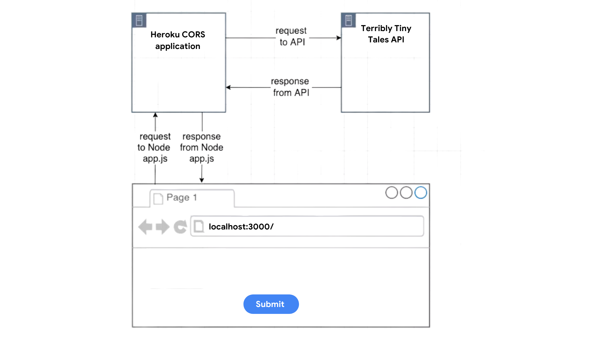
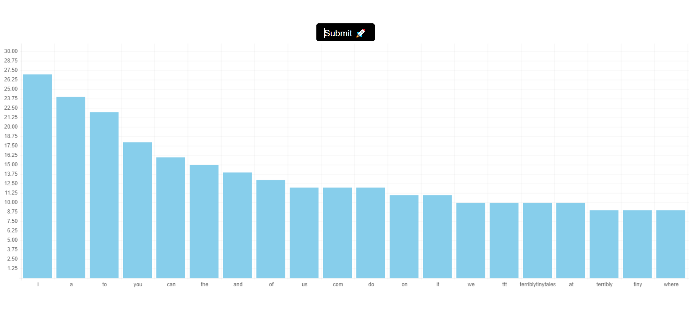

# About Project
- This is a frontend application build using ReactJS. In this project, text data is fetched from an API, parsed & found the frequency of each word and then the top 20 most occuring words is plotted on histogram. 

- In a button click, this application would show all the top 20 occuring words from an API with their occurences and the words which are occuring. 

# Working
- While accessing the data, I was getting CORS error which I couldn't directly resolve from React so for that I have used [CORS Anywhere](https://github.com/Rob--W/cors-anywhere.git) which makes a proxy request to the API. The proxy server looks like `https://cryptic-headland-94862.herokuapp.com/`. 

- Appending the API url to proxy URL worked and the response could be fetched in ReactJS without using any headers like `Access-Control-Allow-Origin`.

- The flow of request & response is as depicted below:
 

 

- For plotting history, I have used `react-chart-histogram` which is the Simple and easy-to-use React component to create 'canvas' histograms

- The application looks like below:

  

### [Live Demo](https://words-histogram.netlify.app) 

 

### Getting Started 
In the project directory, you can run: `npm install` to install all the dependencies and then command `npm start` to run the application

The app in the development mode would be at [http://localhost:3000](http://localhost:3000).

The page will reload when you make changes.
